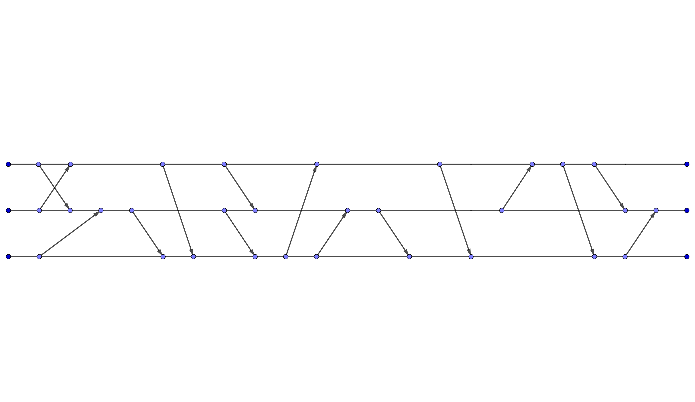
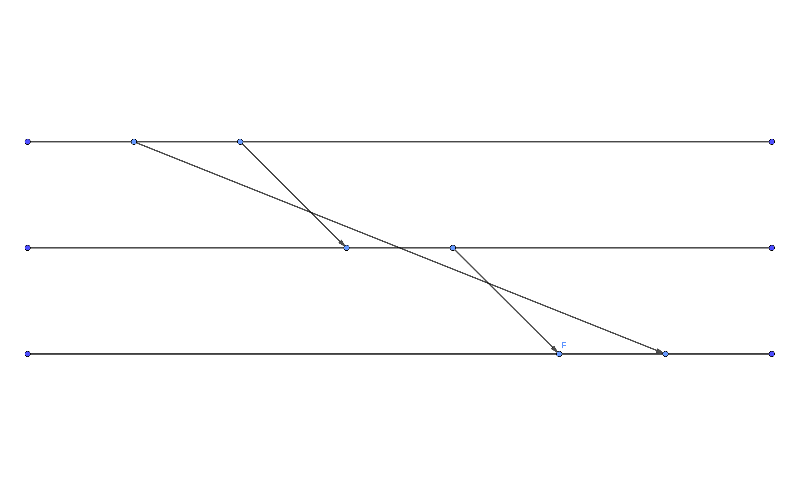

# MINI-PROJET ERLANG

L'objectif de ce mini-projet est d'implémenter en Erlang l'estampillage matricielle, afin de synchroniser la communication au sein d'un ensemble de processus distribués.

On considère un ensemble de N processus (N étant paramétrable), munis d'horloges matricielles. Chaque fois qu'un processus émet/reçoit un message vers/en provenance des autres processus, il applique le mécanisme de mise à jours et de vérification d'horloge matricielle.

## Comment Utiliser?

### 1) scenario1 :
```
escript -c scenario1
```


### 2) scenarioRandom:
```
escript -c scenarioRandom <M> <N>
```
M represente le nombre de processus et N represente nombre de messages.

### 3) scenarioFIFO :
Une scenario avec un message retardée intentionnel. Le reception de message F est retardée pour respecter FIFO.
```
escript -c scenarioFIFO
```


## Utilisation Manuelle

Dabord il faut creer les processus avec la fonction create_procs(N) :
```
% N : Nombre de processus
horlogeMatricielle:create_procs(N).
```
Quand une processus est pret il affiche "(i) Ready!" (i est le nombre du processus).

Apres tous les processus et requester ecrit qu'ils sont pret on peut utiliser la fonction test(S, R, M) :
```
% S : Sender (an integer between [1, #Processus])
% R : Reciever (an integer between [1, #Processus])
% M : Message (preferably string pour affichage)
horlogeMatricielle:test(S, R, M).
```
Quand on utilise la fonction test(S, R, M), la fonction requester(All_Pids) dire le processus S d'envoi le message M a la processus R.


Ou si vous voulez que votre message arrive quelque seconde en retard vous pouvez utiliser le fonction test_fifo(S, R, M) :
```
% S : Sender (an integer between [1, #Processus])
% R : Reciever (an integer between [1, #Processus])
% M : Message (preferably string pour affichage)
horlogeMatricielle:test_fifo(S, R, M).
```

Les processus emmeteur et receveur vont afficher leurs horloges sur le terminal.

Pour areter les processus utiliser le commande finish()
```
horlogeMatricielle:finish().
```
